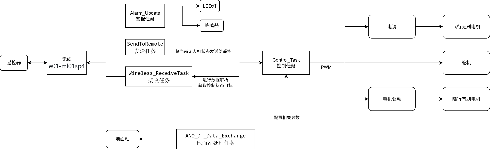
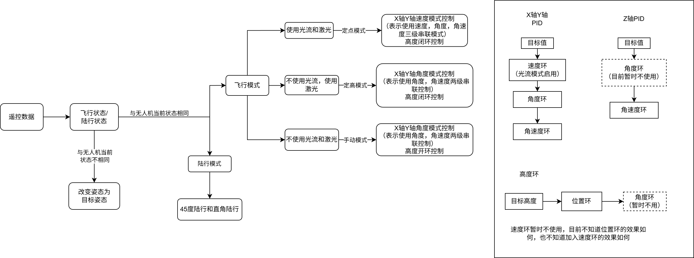
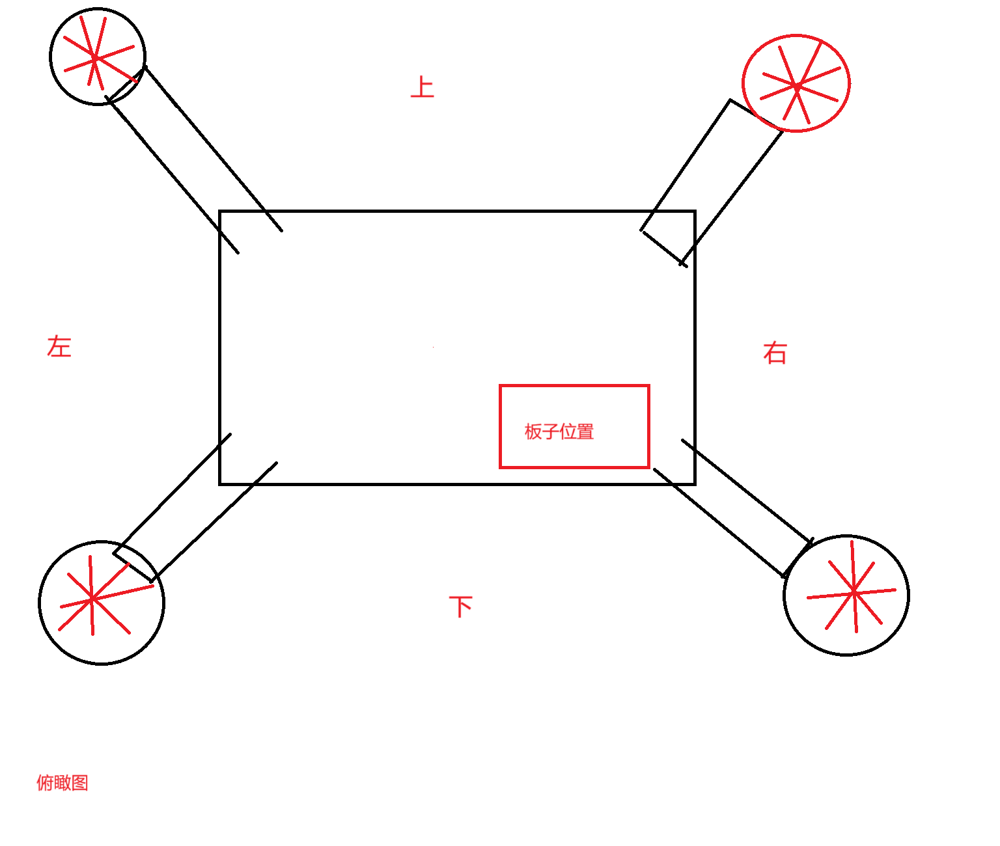
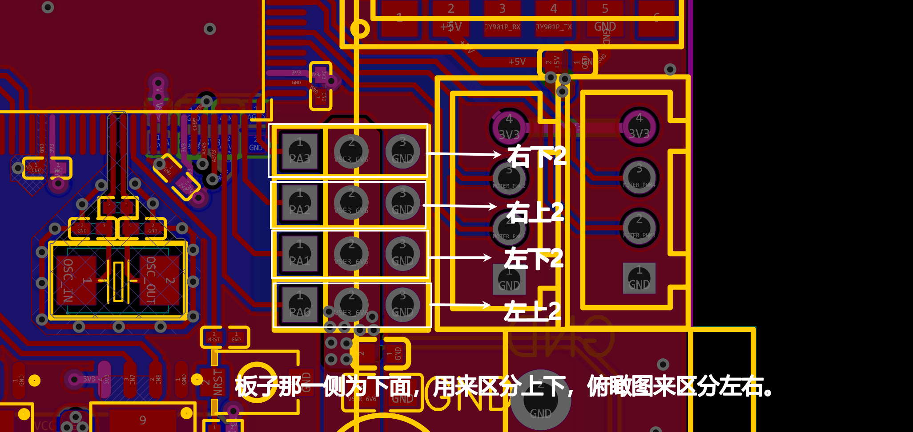
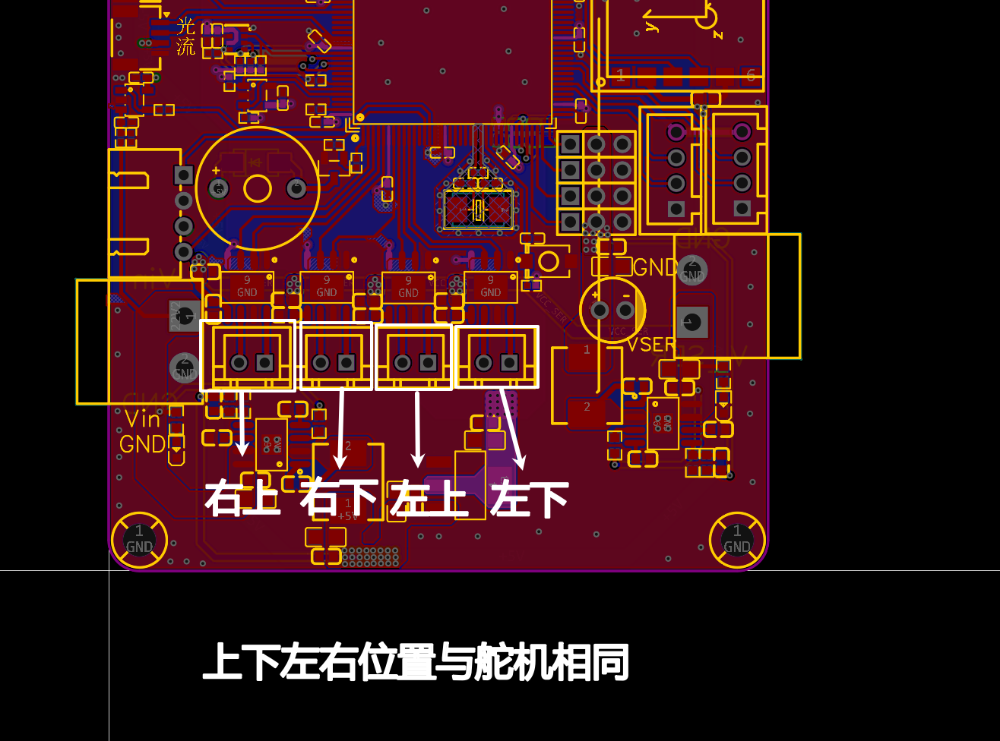

# 陆空无人机主控代码

## 前言

此无人机是为了实现陆行和飞行两用所制作的

## 外围模块使用

- 无线连接：e01-ml01sp4 2.4g
- 气压计：BMP280
- 陀螺仪：jy901p
- GPS定位：BN-220 GPS
- 光流传感器：[MTF-01](https://item.taobao.com/item.htm?abbucket=3&id=692735724689&ltk2=1753434934497w2klgyu8xvmxezkx56odt&ns=1&skuId=5522133784263&spm=a21n57.1.hoverItem.3&utparam=%7B%22aplus_abtest%22%3A%225b961e7e15c48fa8c467f4ffc1634ccf%22%7D&xxc=taobaoSearch)（Micolink）
- 无刷电调：[好盈电调天行者](https://item.taobao.com/item.htm?abbucket=3&id=718634825354&ltk2=17534445879590o4u3kzo5s7qy710vbzvk&ns=1&priceTId=213e07ea17534444554247382e1780&skuId=5493317864968&spm=a21n57.1.hoverItem.4&utparam=%7B%22aplus_abtest%22%3A%22f7a6a54df5340d46d77da9743d17ad15%22%7D&xxc=taobaoSearch)  使用TIM8(APB2)
- 电机驱动：使用TIM3(APB1)
- 舵机：使用TIM2(APB1)

## 框架说明

本框架参考了正点原子MiniFly框架，并对此框架进行了简化，目前(2025/9/25)不是最终框架，后续可能会进行调整

Alarm_Update：用于监测各项数据，比如当电池电压小于22V时，蜂鸣器会每隔一秒鸣叫一下

usmart_task：串口调试互交组件，通过串口助手调用程序里面的任何函数

ANO_DT_Data_Exchange：地面站数据接收与发送任务，地面站可以配置PID参数

SendToRemote：用于发送无人机状态给遥控

Wireless_ReceiveTask：对遥控的控制信息进行解析

Control_Task：对电机进行PID控制

## PID算法流程图

## 舵机，电杆接线位置

以板子的相对位置作为参考方向舵机和电杆分别编号为左下、左上、右下、右上。

电调接线参考代码注释

## 参考代码

[嘉立创无人机小系统](https://oshwhub.com/PQG2030PQG/kai-yuan-si-zhou-fei-xing-qi)

[正点原子MiniFly开源代码](http://www.openedv.com/docs/fouraxis-fly/minifly.html)

[微空科技官方解析代码](https://micoair.cn/docs/Micolink-xie-yi-ding-yi-yu-jie-xi)

[E01-ML01SP4官方例程](https://www.ebyte.com/product/49.html)

[lcd](https://github.com/deividAlfa/ST7789-STM32-uGUI)

## 相关资料

[bn220](https://www.beitian.com/sys-pd/10.html)