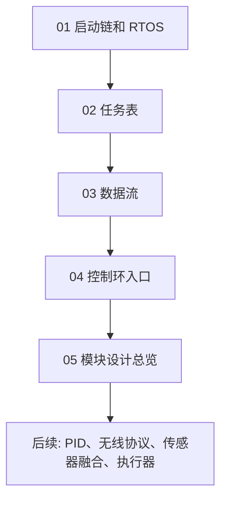

# RoboDrone 底层阅读路线

这组文档的目标不是替代源码，而是帮你建立一张“上电以后系统怎么活起来”的地图。建议按下面顺序读，每一章都配合源码打开看。

## 先看什么

1. `Core/Src/main.c`
   - 看硬件初始化顺序。
   - 找到 `xTaskCreate(App_InitTask, "Init", ...)`。
   - 理解为什么后面会进入 `osKernelStart()`，而 `while (1)` 基本不会再执行。

2. `user/app/app_init.c`
   - 这是业务初始化中心。
   - 这里完成日志、延时、全局时间、传感器、无线、控制、电机、电杆、看门狗初始化。
   - 这里创建真正有业务含义的 FreeRTOS 任务。

3. `Core/Src/freertos.c`
   - CubeMX 生成的 FreeRTOS 初始化文件。
   - 当前只创建一个 `defaultTask`，这个任务每 1ms `osDelay(1)`，没有业务逻辑。

4. `user/control/control.c`
   - `Control_Task` 是飞控核心循环。
   - 它每 1ms 读取状态、读取遥控目标、选择飞行/行走/变形控制，再输出到执行器。

## 推荐学习顺序

## 读源码时抓住三类问题

- 谁创建谁：任务在哪里创建，优先级和栈多大。
- 谁唤醒谁：任务是周期 delay、信号量唤醒，还是队列阻塞。
- 数据怎么走：传感器数据进 `state`，遥控数据进 `setpoint`，控制输出进 `MotorCtrl`。
- 为什么这么分层：`05 模块设计总览` 解释每个 `user/` 模块的职责、设计原因和优点。

## 当前项目的核心事实

- RTOS tick 是 1000Hz，所以 `vTaskDelayUntil(..., 1)` 就是 1ms 周期。
- 真正业务任务由 `App_InitTask` 创建，不是 CubeMX 默认的 `defaultTask`。
- 当前 `ENABLE_GCS_SERIAL = 1`，地面站串口任务会按 `USE_USMART_OR_ANO` 选择创建 ANO_DT 或 usmart。
- 控制核心 `Control_Task` 优先级是 2，但看门狗任务优先级是 5，无线接收任务优先级是 4。
- `Wireless_ReceiveTask` 主要靠外部中断释放信号量唤醒，不是固定周期轮询。

