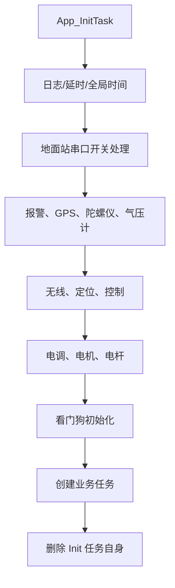

# 01 启动链和 FreeRTOS

这一章回答一个最基础的问题：板子上电后，代码从哪里开始跑，什么时候进入 RTOS，业务任务又是谁创建的。

## 从 main.c 开始

`Core/Src/main.c` 是 CubeMX 生成的入口。它先完成一批外设初始化：

- HAL 和系统时钟
- GPIO、DMA
- I2C、SPI
- 多路 UART
- ADC
- TIM1/TIM2/TIM3/TIM6/TIM8

随后在 `USER CODE BEGIN 2` 中创建初始化任务：

```c
xTaskCreate(App_InitTask, "Init", 250, NULL, 20, NULL);
```

这个任务的优先级是 20，明显高于后续业务任务。它的目的不是长期运行，而是“等 RTOS 开始调度后，在任务上下文里完成初始化和创建业务任务”。

接着 `main.c` 调用：

```c
osKernelInitialize();
MX_FREERTOS_Init();
osKernelStart();
```

`osKernelStart()` 之后控制权交给 FreeRTOS 调度器。正常情况下，后面的 `while (1)` 不再承担业务工作。

## CubeMX 默认任务

`Core/Src/freertos.c` 由 CubeMX 生成。当前它只创建了一个默认任务：

```c
defaultTaskHandle = osThreadNew(StartDefaultTask, NULL, &defaultTask_attributes);
```

默认任务参数：

- 名称：`defaultTask`
- 栈：`128 * 4` 字节
- 优先级：`osPriorityLow`

任务函数 `StartDefaultTask` 只是无限循环：

```c
for (;;)
{
    osDelay(1);
}
```

所以当前项目里，`defaultTask` 更像 CubeMX 占位任务，不是飞控业务入口。

## 真正的业务初始化

`user/app/app_init.c` 的 `App_InitTask` 才是业务启动中心。它做三件事：

1. 检查是否由独立看门狗复位启动。
2. 初始化软件组件、传感器、无线、控制、动力系统和执行器。
3. 创建长期运行的业务任务，然后 `vTaskDelete(NULL)` 删除自己。

初始化顺序大致是：



## FreeRTOS 配置要点

`Core/Inc/FreeRTOSConfig.h` 里几个设置很关键：

- `configTICK_RATE_HZ = 1000`：系统 tick 为 1kHz。
- `configMAX_PRIORITIES = 56`：优先级可用范围很大。
- `configTOTAL_HEAP_SIZE = 15360`：动态创建任务、队列、信号量都从这个堆里分配。
- `INCLUDE_vTaskDelayUntil = 1`：项目可以使用固定周期任务。
- `USE_FreeRTOS_HEAP_4`：使用 heap_4 内存管理。

理解 tick 频率后，源码里的周期就很好读：

- `vTaskDelayUntil(&lastWakeTime, 1)` 是 1ms。
- `pdMS_TO_TICKS(20)` 是 20ms。
- `vTaskDelayUntil(&lastWakeTime, 100)` 是 100ms。

## 一句话记忆

这个项目的启动链是：

```text
main.c 初始化硬件 -> 创建 App_InitTask -> 初始化 CMSIS/FreeRTOS 对象 -> 启动调度器 -> App_InitTask 创建业务任务 -> Control_Task 等任务长期运行
```

