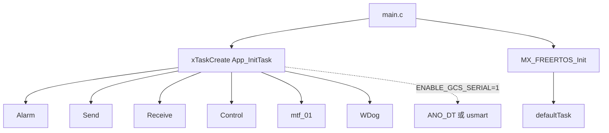

# 02 FreeRTOS 任务表

这一章把当前项目的长期任务列出来。读懂这张表以后，再看源码就不容易迷路。

## 任务总表

| 任务名        | 函数                   | 创建位置      |栈参数| 优先级 | 触发/周期 | 主要职责 |

| `Init`        | `App_InitTask`            | `main.c`      | 250  | 20  |启动后执行一次 | 初始化系统并创建业务任务 |
| `defaultTask` | `StartDefaultTask`     | `freertos.c`  | 512  | Low | 1ms 空 delay | CubeMX 默认占位 |
| `Alarm`       | `Alarm_Update`         | `app_init.c` | 150  | 2   | 100ms | 电池、LED、蜂鸣器、报警状态 |
| `ANO_DT`      | `ANO_DT_Data_Exchange` | `app_init.c` | 350  | 2   | 20ms | 地面站遥测和 PID 调试数据 |
| `usmart`      | `usmart_task`          | `app_init.c` | 250  | 2   | 20ms | 串口函数调试 |
| `Send`        | `SendToRemote`         | `app_init.c` | 350  | 2   | 20ms | 向遥控器发送状态 |
| `Receive`     | `Wireless_ReceiveTask` | `app_init.c` | 350  | 4   | 中断信号量/50ms 超时 | 接收遥控无线数据 |
| `Control`     | `Control_Task`         | `app_init.c` | 500  | 2   | 1ms | 飞控核心控制环 |
| `mtf_01`      | `mtf_01_task`          | `app_init.c` | 150  | 3   | 队列阻塞 | 光流/TOF 串口数据解析 |
| `WDog`        | `WatchdogGuard_Task`   | `app_init.c` | 180  | 5   | 20ms | 喂独立看门狗 |
| `VibData`     | `Vibration_Data_Task`  | `ANO_DT.c`    | 256  | 3   | 5ms | 高频振动调试数据，当前未启用 |

说明：

- `ANO_DT` 和 `usmart` 互斥，取决于 `USE_USMART_OR_ANO`。
- 当前 `ENABLE_GCS_SERIAL = 1`，会按 `USE_USMART_OR_ANO` 在 `ANO_DT` 和 `usmart` 之间选择一个创建。
- `VibData` 的初始化调用被注释，默认不会创建。

## 任务创建关系

## 为什么 Init 优先级很高

`App_InitTask` 的优先级是 20，远高于后续任务。这样调度器启动后，它会优先完成初始化，创建其他任务，再删除自己。

这可以避免很多裸机初始化里不方便做的事，例如：

- 使用 `vTaskDelay(500)` 等待外设稳定。
- 创建信号量、队列、任务。
- 在任务上下文里初始化依赖 RTOS 的模块。

## 周期任务和事件任务

这个项目里任务大致分两类：

- 固定周期任务：`Control`、`Send`、`Alarm`、`WDog`、`ANO_DT`、`usmart`。
- 事件驱动任务：`Receive`、`mtf_01`。

`Control_Task` 是最重要的固定周期任务，每 1ms 执行一次。它决定飞行控制的节奏。

`Wireless_ReceiveTask` 是事件驱动任务。nRF24L01 的 IRQ 引脚触发 `HAL_GPIO_EXTI_Callback`，中断里释放 `wireless_semaph`，接收任务拿到信号量后解析数据。它还有 50ms 超时和空闲恢复逻辑，避免无线链路卡死。

`mtf_01_task` 也是事件驱动。串口 DMA 回调把 27 字节数据送入 `mtf_data_queue`，任务阻塞等待队列，再逐字节解码 Micolink 数据。

## 优先级怎么看

FreeRTOS 数字越大优先级越高。当前几个关键任务：

- `WDog`：5，最高，保证能及时喂狗。
- `Receive`：4，高于发送任务，源码注释也强调接收优先级要比发送高。
- `mtf_01`：3，光流解析高于普通业务任务。
- `Control`、`Send`、`Alarm`：2。

一个直观理解：无线接收和看门狗更偏“不能错过”，控制环虽然 1ms 运行，但它和普通业务任务同优先级，靠 `vTaskDelayUntil` 固定节奏。
