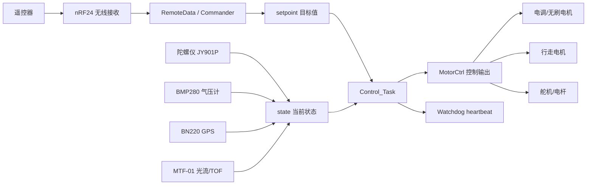
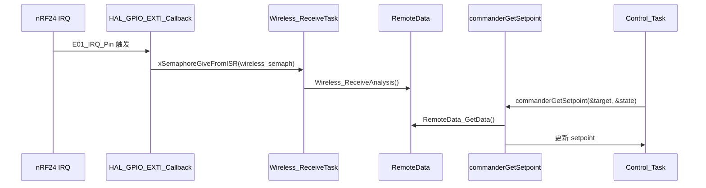

# 03 系统数据流

这一章回答“各个任务之间到底传什么数据”。先不要急着看每个 PID 细节，先把输入、状态、目标、输出四层分清楚。

## 总体数据流



## 遥控数据进入 setpoint

无线接收链路大致是：



`commanderGetSetpoint` 会根据遥控数据和当前模式生成目标值：

- 飞行模式下，姿态、油门、高度/速度目标进入 `setpoint`。
- 行走模式下，摇杆直接映射行走电机和转向目标。
- 如果安全锁存触发，会强制锁定遥控，关闭起飞/降落命令。

## 传感器数据进入 state

`Control_Task` 每 1ms 调用 `refreshState(&state)`。这个函数聚合当前状态：

- `gyro_getAngularVelocity` 读角速度。
- `gyro_getAngle` 读姿态角。
- `gyro_getAcc` 读加速度。
- `position_GetVelocity` 读/算光流速度。
- `position_GetHeight` 读高度。
- `position_GetPosition` 读位置。

所以 `state` 可以理解为“控制环这一拍看到的世界”。

## 控制环输出 MotorCtrl

`Control_Task` 的核心顺序是：

```text
WatchdogGuard_ControlHeartbeat()
refreshState(&state)
commanderGetSetpoint(&target, &state)
根据模式选择 Flight_Update / Walk_Update / changeAttitude
safeCheck(&control, &state)
MotorControl(&control)
vTaskDelayUntil(..., 1)
```

飞行模式 `Flight_Update` 会调用：

- `Roll_Pitch_Control`
- `Yaw_Control`
- `Height_Control`

然后把油门和姿态 PID 输出混控成四个电调百分比。

行走模式 `Walk_Update` 不使用四轴电调输出，而是根据油门和 yaw 目标计算左右行走电机 PWM，并把电调输出清零。

安全检查 `safeCheck` 会处理两类危险：

- 姿态、高度、角速度等状态出现非有限值。
- 飞行模式下 roll/pitch 超过 45 度。

触发后会锁定控制、关闭电调输出并切到报警错误模式。

## 任务间同步对象

当前值得先认识三个同步对象：

| 对象 | 创建位置 | 类型 | 用途 |
|---|---|---|---|
| `wireless_semaph` | `wireless.c` | 二值信号量 | nRF24 IRQ 唤醒无线接收任务 |
| `remote_send_semaph` | `remotedata.c` | 二值信号量 | 触发/协调向遥控器发送状态 |
| `mtf_data_queue` | `mtf_01.c` | 队列 | 串口回调把光流数据交给解析任务 |

先理解这些对象，就能看懂为什么有些任务没有固定周期，却能在数据到达时马上工作。

