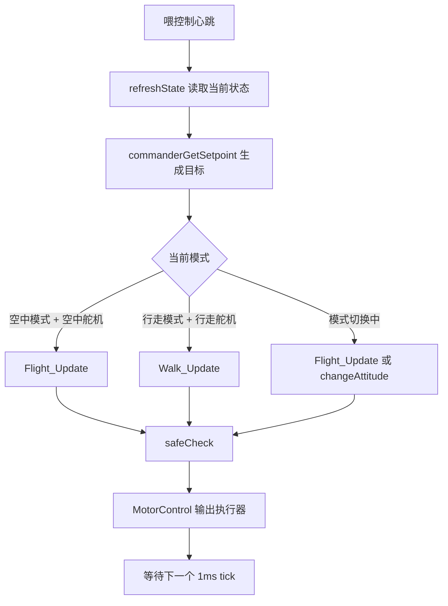

# 04 控制环入口

这一章只讲控制环怎么进入、每拍做什么、不同模式怎么分流。PID 参数和调参细节可以后面单独学。

## Control_Init 做什么

`Control_Init()` 主要初始化控制器状态和 PID 实例：

- 位置环 PID：高度、X、Y。
- 速度环 PID：X、Y、Z。
- 姿态角 PID：roll、pitch、yaw。
- 角速度 PID：roll、pitch、yaw。

这说明飞控不是一个 PID 从头管到尾，而是多层控制：


不同轴和不同模式会走不同分支，但先记住“目标层层变成更底层目标，最后变成执行器输出”就够了。

## Control_Task 每 1ms 跑一拍

`Control_Task` 是飞控核心任务，周期是 1ms：

```c
vTaskDelayUntil(&lastWakeTime, 1);
```

每一拍的主流程是：



## 飞行模式入口

飞行模式调用 `Flight_Update(&control, &target, &state)`。

它先判断遥控是否锁定。如果未锁定，就执行：

```text
Roll_Pitch_Control
Yaw_Control
Height_Control
```

然后把高度控制得到的油门和三轴角速度 PID 输出混控到四个电调：

```text
M1 = throttle + roll + pitch - yaw
M2 = throttle - roll - pitch - yaw
M3 = throttle - roll + pitch + yaw
M4 = throttle + roll - pitch + yaw
```

最后还会限制电调百分比，避免输出过低或过高。

## 行走模式入口

行走模式调用 `Walk_Update(&control, &target, &state)`。

它主要使用：

- `target->thrust` 作为前后动力。
- `target->angle.yaw` 作为转向量。

输出到四个行走电机 PWM，并把四个电调输出清零。这说明行走模式和飞行模式共享同一个 `Control_Task`，但输出对象不同。

## 模式切换入口

当姿态模式和舵机模式不完全匹配时，代码进入中间分支：

- 如果遥控飞行键仍然有效，则继续 `Flight_Update`。
- 否则调用 `changeAttitude(&control, &state)` 做变形/姿态切换。

这部分涉及舵机、电杆和模式状态，建议等 RTOS 和主控制环熟悉以后再读。

## 看门狗和安全检查

`Control_Task` 每拍调用 `WatchdogGuard_ControlHeartbeat()`。`WatchdogGuard_Task` 每 20ms 检查一次，如果控制心跳超过 50ms 没更新，就停止喂独立看门狗，让系统复位。

`safeCheck` 是软件层安全保护。它会检查：

- 姿态、角速度、高度是否为有效浮点数。
- 飞行模式下 roll/pitch 是否超过 45 度。

触发后会锁定飞行、关闭输出，并进入报警错误模式。

## 读这一章后应该能回答

- 为什么 `Control_Task` 是项目里最值得先读的任务。
- `state` 和 `target` 分别代表什么。
- 飞行模式和行走模式在哪里分开。
- 为什么看门狗关注的是控制心跳，而不是所有任务都各自喂狗。

