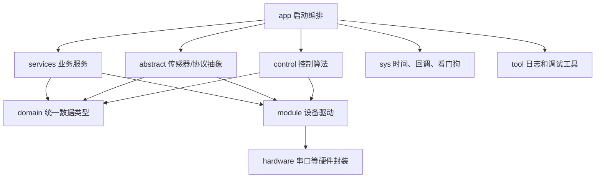

# 05 模块设计总览

这一章回答“每个模块为什么这样写、起什么作用、有什么优点”。它不是 API 手册，而是一张读源码时的设计地图。建议先读前面的启动链、任务表、数据流和控制环入口，再回到这里按模块看。

## 总体分层

这套分层的核心思想是：上层关心“飞行、行走、目标、状态”，下层关心“串口、PWM、I2C、SPI、DMA”。这样改控制逻辑时不用直接碰每个外设寄存器，换传感器或通信方式时也不必重写控制环。

## app：启动编排层

| 项目 | 说明 |
|---|---|
| 职责 | 统一完成系统服务、外设、业务模块初始化，并创建 FreeRTOS 业务任务。 |
| 为什么这样写 | STM32 上电后硬件初始化在 `main.c`，但很多业务模块需要 RTOS 已经启动后才能安全创建队列、信号量和任务，所以把业务启动集中到 `App_InitTask`。 |
| 代码作用 | `App_InitSystemModules()` 按顺序初始化日志、延时、全局时间、告警、传感器、无线、控制、电机、电杆；`App_StartTasks()` 创建 Alarm、ANO_DT/usmart、Send、Receive、Control、mtf_01、WDog 等任务。 |
| 优点 | 初始化顺序清晰，任务栈和优先级集中可查，减少 `main.c` 和 CubeMX 生成代码里的业务逻辑。 |
| 关键文件 | `user/app/app_init.c`、`user/app/app_system.c`、`user/app/app_tasks.c`、`Core/Src/main.c`。 |
| 阅读提示/风险点 | `ENABLE_GCS_SERIAL` 和 `USE_USMART_OR_ANO` 决定地面站串口任务；新增任务时要同时考虑栈、优先级、初始化顺序和看门狗影响。 |

## domain：统一数据模型

| 项目 | 说明 |
|---|---|
| 职责 | 定义项目里跨模块共享的状态、目标、控制输出和模式类型。 |
| 为什么这样写 | 控制、服务、传感器和执行器都要交换数据，如果每个模块各自定义一套结构，后期会出现字段含义不一致、单位混乱和强耦合。 |
| 代码作用 | `state_t` 表示当前状态，`setpoint_t` 表示目标值，`MotorCtrl` 表示执行器输出，`CtrlMode` 和 `AttitudeMode` 表示控制/姿态模式。 |
| 优点 | 数据边界明确，`Control_Task` 可以只围绕 `state`、`target`、`control` 三类对象工作，阅读主流程更容易。 |
| 关键文件 | `user/domain/drone_types.h`、`user/domain/vector_types.h`、`user/domain/vehicle_state.h`、`user/domain/flight_mode.h`、`user/domain/actuator_types.h`。 |
| 阅读提示/风险点 | 修改字段时要同步检查通信打包、控制计算和遥测发送；尤其注意单位，如 cm、cm/s、角度、PWM 百分比。 |

## services：业务服务层

| 项目 | 说明 |
|---|---|
| 职责 | 把遥控、无线链路、告警等业务能力整理成稳定接口，供 app 和 control 使用。 |
| 为什么这样写 | 遥控数据、无线收发、告警状态都不是纯底层驱动，也不是控制算法本身。放到 services 后，业务流程和芯片驱动可以分开演进。 |
| 代码作用 | `remotedata` 解析遥控数据帧并回传状态；`commander` 把摇杆、按键、模式和当前状态转换成 `setpoint`；`wireless` 管理无线链路收发、接收回调和链路恢复；`alarm` 管理电池检测、蜂鸣器、LED 和电池开关。 |
| 优点 | 遥控协议、链路收发、告警策略和控制算法解耦；后续替换无线芯片或调整遥控协议时，影响范围更清楚。 |
| 关键文件 | `user/services/remotedata.c`、`user/services/commander.c`、`user/services/wireless.c`、`user/services/alarm.c`。 |
| 阅读提示/风险点 | 遥控失联会影响锁定和降落逻辑；无线链路恢复会重新初始化 RF 芯片；告警服务会直接控制 LED、蜂鸣器和电池开关。 |

## abstract：传感器/协议抽象层

| 项目 | 说明 |
|---|---|
| 职责 | 暂时承接尚未迁移的传感器、定位和地面站协议抽象。 |
| 为什么这样写 | 当前工程仍有历史模块混在 `abstract` 中。迁移时要按风险拆：无线、告警已迁到 services；定位和地面站协议因为仍有调试改动，暂时保留。 |
| 代码作用 | `gyro` 提供姿态角、角速度和加速度；`position` 聚合高度、速度和位置；`ANO_DT` 负责地面站协议和调试数据。 |
| 优点 | 暂时保留稳定入口，避免一次性迁移传感器、定位和地面站协议导致运行风险扩大。 |
| 关键文件 | `user/abstract/gyro.c`、`user/abstract/position.c`、`user/abstract/ANO_DT.c`。 |
| 阅读提示/风险点 | 抽象层经常连接中断、DMA、任务和全局状态；改动时要注意是否被 `Control_Task`、`SendToRemote` 或地面站任务并发读取。 |

## control：控制算法层

| 项目 | 说明 |
|---|---|
| 职责 | 周期读取状态和目标，计算飞行、行走和变形输出，并执行安全检查。 |
| 为什么这样写 | 飞控需要稳定的固定节奏。项目把主控制循环放在 1ms 的 `Control_Task` 中，再用不同频率宏控制姿态、速度、位置等子环执行节奏。 |
| 代码作用 | `Control_Init()` 初始化多组 PID；`Control_Task()` 每拍刷新 `state`、生成 `target`、按模式分流；`Flight_Update()` 做姿态/高度控制和四轴混控；`Walk_Update()` 做行走电机输出；`changeAttitude()` 处理变形动作。 |
| 优点 | 飞行和行走共享一个状态入口，但输出路径清楚分离；PID 配置集中，便于对比不同轴的参数和滤波策略；安全检查统一收口。 |
| 关键文件 | `user/control/control.c`、`user/control/PIDcontroller.c`、`user/control/change.c`。 |
| 阅读提示/风险点 | PID 参数、死区、滤波和输出限幅会直接影响实机表现；变形动作时间较长，必须和看门狗长动作保护配合。 |

## module：设备驱动层

| 项目 | 说明 |
|---|---|
| 职责 | 直接驱动具体传感器、通信芯片、执行器和存储器。 |
| 为什么这样写 | 每个设备都有自己的协议和时序，把它们隔离在 `module` 里，可以避免业务代码散落大量寄存器、校验和 PWM 细节。 |
| 代码作用 | `RF/nRF24L01P` 驱动 2.4G 无线芯片；`gyro/jy901p` 解析姿态模块；`bmp280` 读取气压温度；`bn220` 解析 GPS；`mtf01` 解析光流/TOF；`motor` 下的 `esc`、`motor`、`servo`、`actuator` 输出动力和变形机构控制；`at24c02` 保存模式配置。 |
| 优点 | 设备边界清晰，方便单独替换或调试某个硬件；上层可以通过抽象接口复用设备能力，而不是重复写收发细节。 |
| 关键文件 | `user/module/RF/nRF24L01P.c`、`user/module/mtf01/mtf_01.c`、`user/module/motor/esc.c`、`user/module/motor/motor.c`、`user/module/at24c02/AT24Cxx.c`。 |
| 阅读提示/风险点 | 设备驱动通常和 CubeMX 外设配置强相关；改引脚、定时器、DMA 或串口时，应优先改 `project.ioc` 并重新生成，而不是只改驱动代码。 |

## hardware：硬件封装层

| 项目 | 说明 |
|---|---|
| 职责 | 封装 STM32 HAL 串口收发、DMA、中断回调和 printf 输出。 |
| 为什么这样写 | 多个模块都要用串口，如果直接在业务层调用 HAL，会让回调分发、缓冲区管理和 DMA 状态处理变得分散。 |
| 代码作用 | `USART_DataTypeInit()` 建立串口对象；HAL UART 回调中根据串口对象分发接收数据；`fputc` 支持标准输出重定向。 |
| 优点 | 串口使用方式统一，日志、ANO_DT、USMART 和传感器数据都能共享一套端口封装思路。 |
| 关键文件 | `user/hardware/usart/usart_port.c`、`user/hardware/usart/usart_port.h`。 |
| 阅读提示/风险点 | UART 回调运行在中断上下文，不能做耗时操作；DMA 缓冲区长度、回调函数和串口实例必须对应。 |

## sys：系统基础设施

| 项目 | 说明 |
|---|---|
| 职责 | 提供全局时间、软件延时、回调观察者和看门狗保护。 |
| 为什么这样写 | 飞控任务很多，不能只依赖阻塞式延时；同时系统需要能发现控制环卡死，并用独立看门狗恢复。 |
| 代码作用 | `globalTime` 维护全局时间基准；`Mydelay` 提供标签化延时判断；`IT_Callback` 用观察者方式分发中断事件；`watchdog_guard` 检查控制心跳并管理长动作期间的喂狗策略。 |
| 优点 | 时间和安全机制集中，业务代码可以用更明确的接口表达“等待”“周期”“心跳”“长动作”。 |
| 关键文件 | `user/sys/globalTime.c`、`user/sys/Mydelay.c`、`user/sys/IT_Callback.c`、`user/sys/watchdog_guard.c`。 |
| 阅读提示/风险点 | 看门狗保护的目标是发现控制环异常，不是掩盖长时间阻塞；新增长耗时动作时要明确进入和退出长动作保护。 |

## tool：日志和调试工具

| 项目 | 说明 |
|---|---|
| 职责 | 提供运行日志、串口函数调试、地面站辅助数据和上位机采集分析工具。 |
| 为什么这样写 | 嵌入式飞控很难只靠断点调试，必须把关键状态通过串口、地面站或文件记录出来，才能定位实机问题。 |
| 代码作用 | `log` 模块提供分级日志和串口发送；`USMART` 支持串口调用调试函数；`python` 工具解析 ANO_DT 高频振动数据并保存 CSV；TraceRecorder 相关代码为任务跟踪预留。 |
| 优点 | 调试手段多，既能在板端打印日志，也能把高频数据拿到 PC 端分析；调试工具和控制逻辑分离，不污染主流程。 |
| 关键文件 | `user/tool/log/README.md`、`user/tool/log/log.c`、`user/tool/USMART/usmart.c`、`user/tool/python/README.md`。 |
| 阅读提示/风险点 | 日志会占用串口、DMA 和 CPU 时间；高频调试数据要关注发送频率，避免影响控制环实时性。 |

## 读源码时的推荐路径

1. 先从 `user/app/app_init.c` 看系统怎么初始化、哪些任务会启动。
2. 再从 `user/domain/drone_types.h` 认识 `state_t`、`setpoint_t`、`MotorCtrl`。
3. 接着看 `user/services/commander.c`，理解遥控输入如何变成目标。
4. 然后看 `user/control/control.c`，沿着 `Control_Task` 跑一遍飞行和行走分支。
5. 最后按需要下钻到 `user/services`、`user/abstract` 和 `user/module`，看遥控、无线、告警、传感器和执行器是怎么接进来的。

如果只记一个原则：业务代码尽量操作“状态、目标、模式、输出”，设备代码才操作“串口、PWM、寄存器、DMA”。这个边界就是当前项目模块化写法最大的价值。
